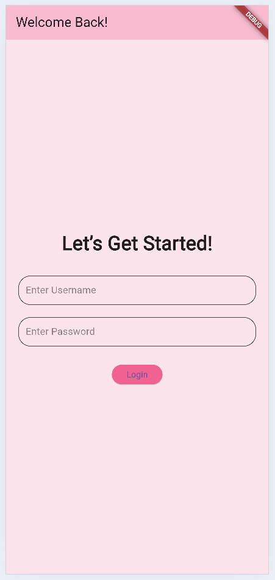
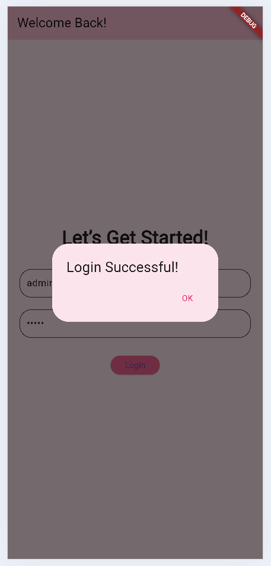
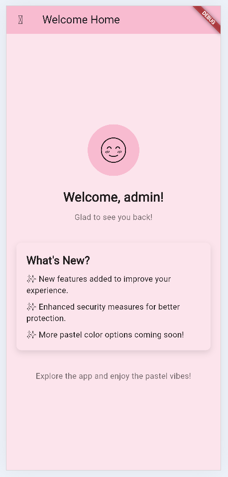
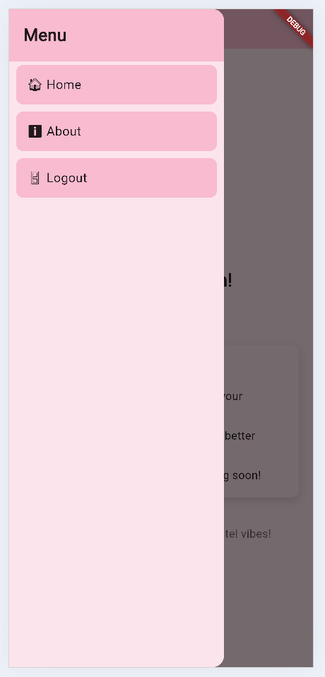
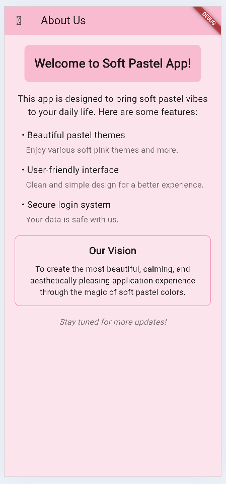

# Tugas Pertemuan 2

**Nama**  : Eka Belandini  
**NIM**   : H1D022002  
**Shift** : F


## Deskripsi Proyek

Proyek ini merupakan aplikasi mobile sederhana yang dibangun menggunakan Flutter. Aplikasi ini memiliki fitur navigasi menggunakan menu samping (sidemenu) dan menyimpan preferensi pengguna menggunakan Shared Preferences. Aplikasi ini dirancang dengan tampilan yang menarik menggunakan skema warna pastel, terutama pink soft.

### Penjelasan File

- **main.dart**: Berisi kode utama aplikasi dan pengaturan routing.
- **sidemenu.dart**: Kode untuk membuat menu samping yang dapat dinavigasi oleh pengguna.
- **home_page.dart**: Halaman yang ditampilkan setelah pengguna berhasil login, menyapa pengguna dengan nama mereka.
- **login_page.dart**: Halaman untuk proses login pengguna.
- **about_page.dart**: Halaman yang berisi informasi tentang aplikasi.

## Demo Aplikasi

Berikut adalah beberapa screenshot dari aplikasi yang menunjukkan tampilan dan fitur yang ada:

### Screenshot Halaman Login


### Screenshot Login Berhasil


### Screenshot Halaman Utama


### Screenshot Sidemenu


### Screenshot Halaman About


## Cara Menjalankan Aplikasi

1. Pastikan Anda sudah menginstal Flutter di komputer Anda.
2. Clone repository ini dengan perintah:
   ```bash
   git clone <URL_REPOSITORY>
